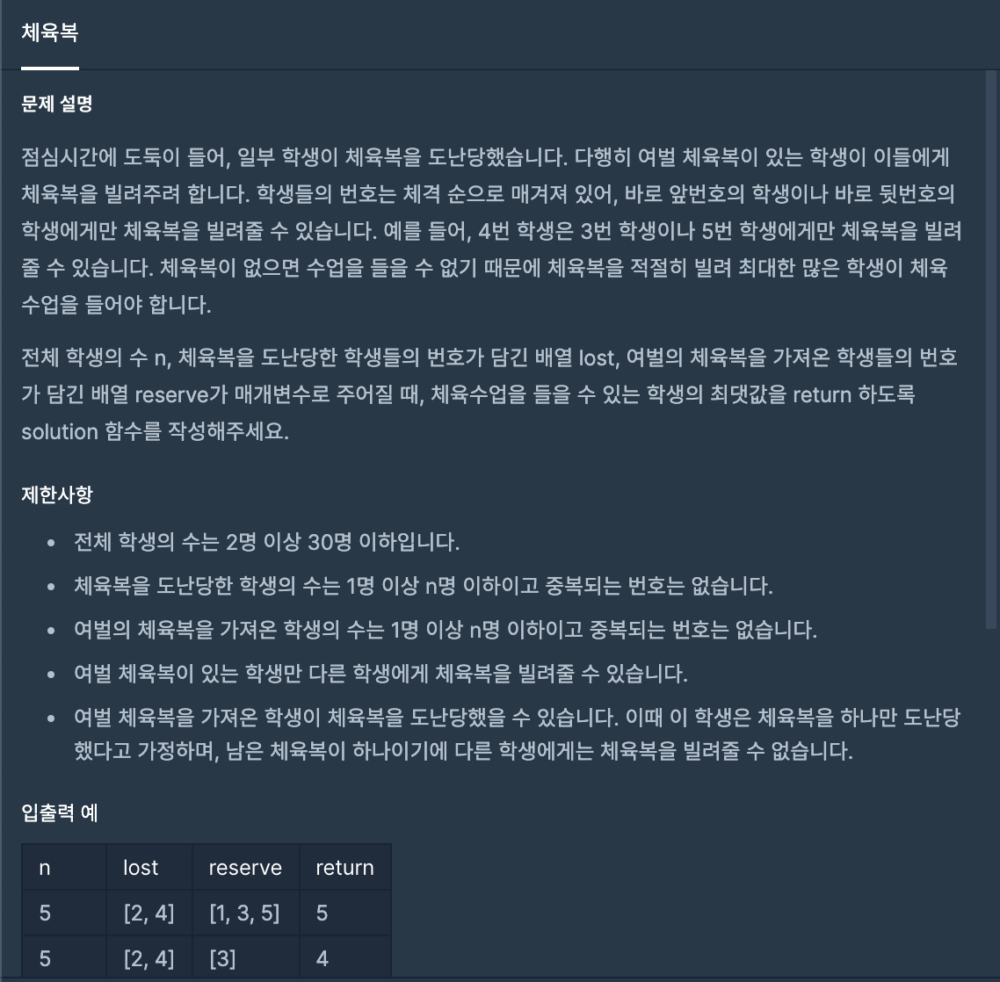
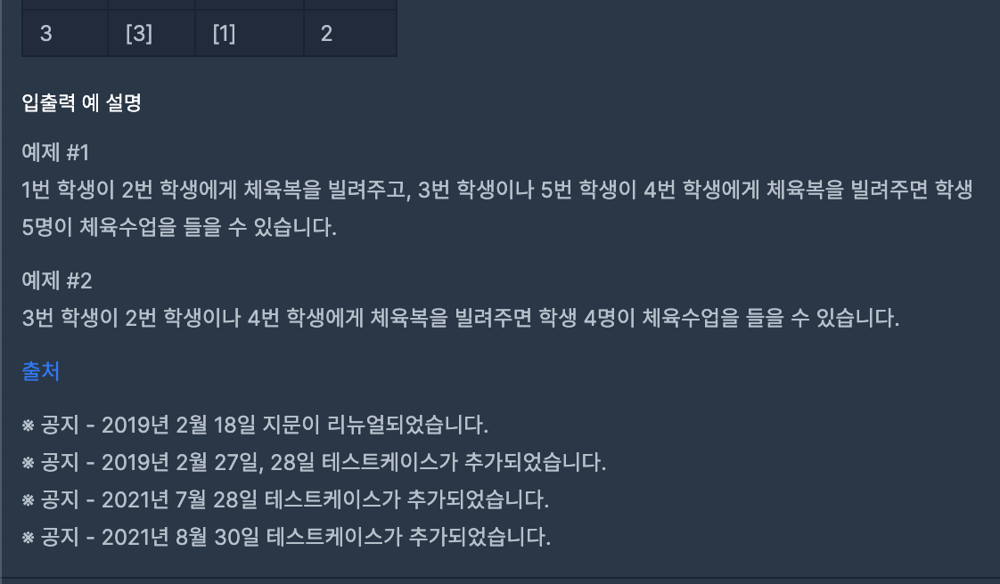

# 26일차




```javascript
function solution(n, lost, reserve) {
    let person = Array.from({length: n}, (v, i) => i + 1);  // 학생수 만큼의 배열.
    let count = 0;
    let realReserve = [];

    for (let i = 0; i < person.length; i++) {
        if (!lost.includes(person[i]) && !reserve.includes(person[i])) {
            count++;
        }
    }
    
    // 진짜 빌려줄 수 있는 애를 찾는다.(realReverse는 진짜 빌려줄 수 있는 애.)
    for (let i = 0; i < reserve.length; i++ ) {
        if (!lost.includes(reserve[i])) {    // 여분도 있고 잃어버리지도 않은 애. -> 얘는 빌려줄 수 있다. 그리고 입기도 한다.
            count++;
            realReserve.push(reserve[i]);
        } else {                            // 있지만 잃어버린 애.(얘는 count를 센다.) -> 얘는 지꺼는 지가 입는다.
            count++;
            // 얘는 잃어버렸지만 자기도 입기 때문에 또 받을 필요가 없으므로 삭제.  
            const index = lost.findIndex(x => x === reserve[i]);

            lost.splice(index, 1);
        }
    }

    // 잃어버린 애들 중 체육복 받을 수 있는 애 찾기. (아.. 다음꺼에서 받을 수 있는 애가 있으면 받아야겟구나)
    const lostSort = lost.sort();                    // 없는애 [1, 3]
    const realReserveSort = realReserve.sort();     // 실제 나눠줄 애 [2, 5]

    for (let i = 0; i < lostSort.length; i++) {
        if (count >= n) {
            break;
        }
        
        const index = realReserveSort.findIndex(x => x === lostSort[i] - 1) > -1 ? realReserveSort.findIndex(x => x === lostSort[i] - 1) : realReserveSort.findIndex(x => x === lostSort[i] + 1);

        if (index > -1) {
            count++;
            realReserveSort.splice(index, 1);
        }
    }
    
    
    
    
    return count;
}
```
