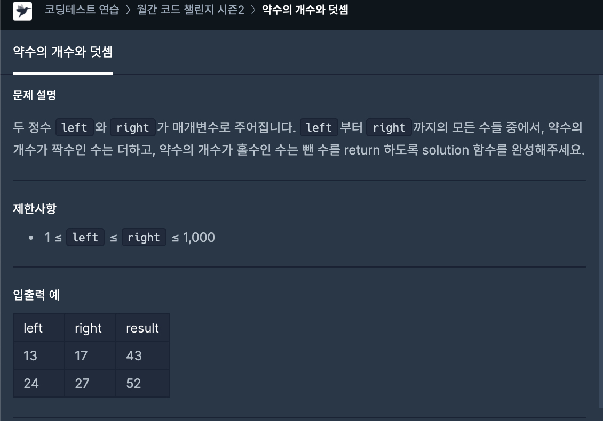

# 27일차




```javascript
function solution(left, right) {
    let answer = 0;

    for (let i = left; i <= right; i++) {
        let arr = [];
        const num = Number.isInteger(Math.sqrt(i)) ?  Math.sqrt(i) : i;
        
        // 제곱근의 약수 찾기.
        for (let j = 0; j <= num; j++) {
            if (num % j === 0) {
                arr.push(j);
            }
        }
        
        // 제곱근의 약수 찾았으면, 진짜 확인할 변수와 제곱근 약수 구하기.
        if (Number.isInteger(Math.sqrt(i))) {
            const diffArr = JSON.parse(JSON.stringify(arr));

            for (let k = 0; k < diffArr.length; k++) {
                if (i % arr[k] === 0) {
                    arr.push(i / arr[k]);     // 몫을 넘긴다.
                }
            }
        }

        const realArr = arr.filter((x, idx) => arr.indexOf(x) === idx);


        if (realArr.length % 2 === 0) {
            answer += i;
        } else {
            answer -= i;
        }
    }

    return answer;
}
```
