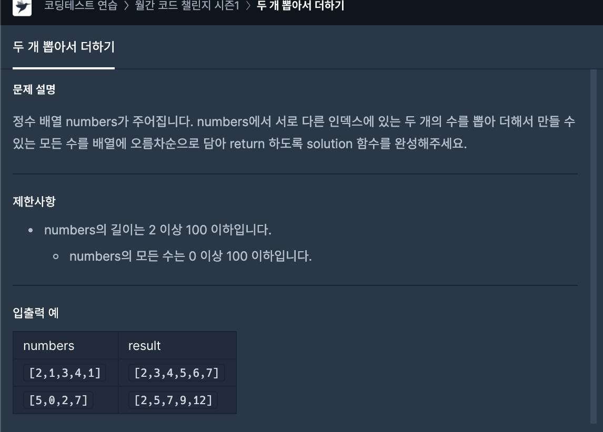

# 28일차




```javascript
function solution(numbers) {
    const arr = [...numbers];

    let answer = [];
    let realAnswer = [];

    // 더해서 만들 수 있는 모든 수의 배열을 오름차순으로 정렬.
    for (let i = 0; i < arr.length; i++) {
        for (let j = i + 1; j < arr.length; j++) {
            if (i !== arr.length - 1) {
                const sum = arr[i] + arr[j];
                answer.push(sum);
            }
        }
    }

    realAnswer = answer.filter((x, index) => answer.indexOf(x) === index);
    
    realAnswer.sort((a, b) => {
        return a - b;
    });

    
    return realAnswer;
}jav
```
