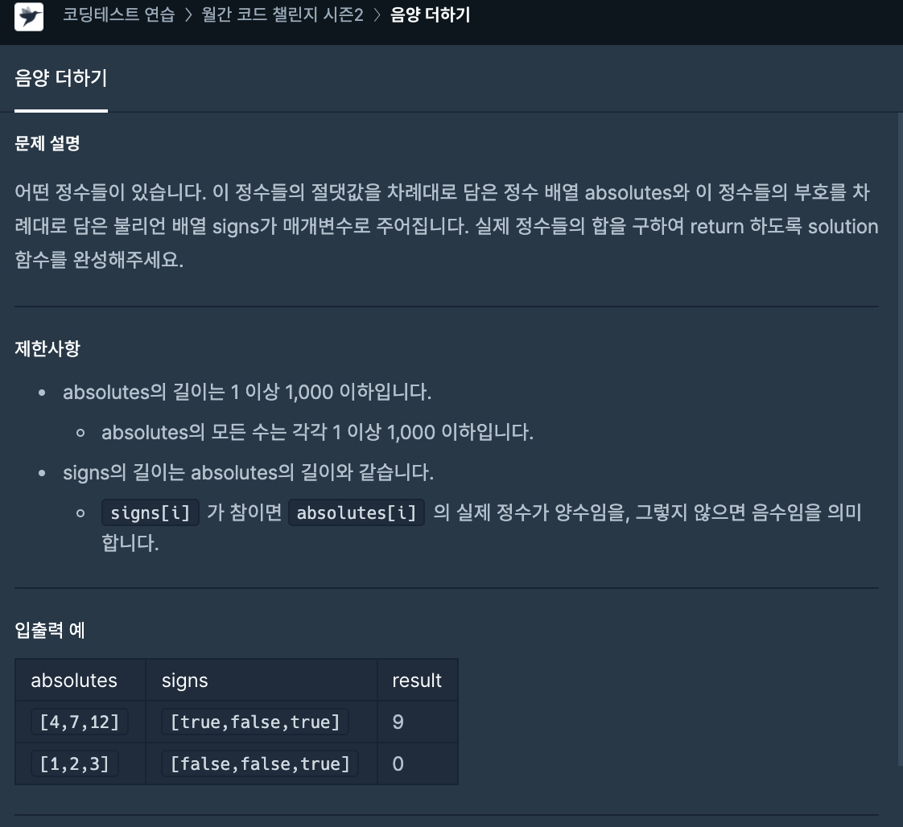

# 30일차




```javascript
function solution(absolutes, signs) {
    var sum = 0;
    var arr = [];

    for (let i = 0; i < signs.length; i++) {
        arr.push(signs[i] === true ? absolutes[i] : absolutes[i] * -1);
    }

    sum = arr.reduce((prev, curr) => prev + curr);
    
    return sum;
}
```
