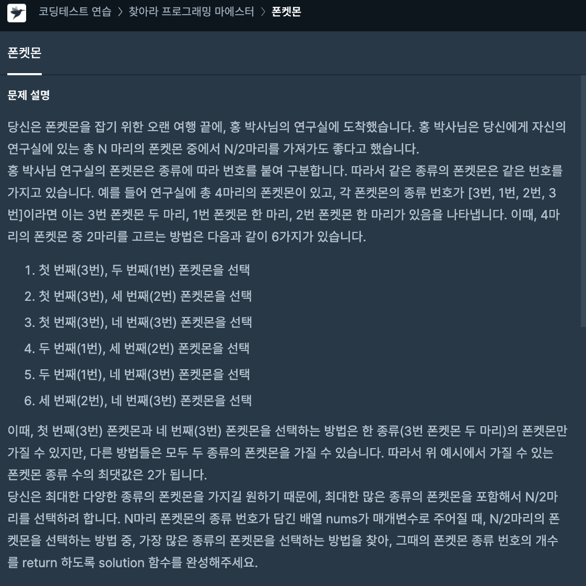
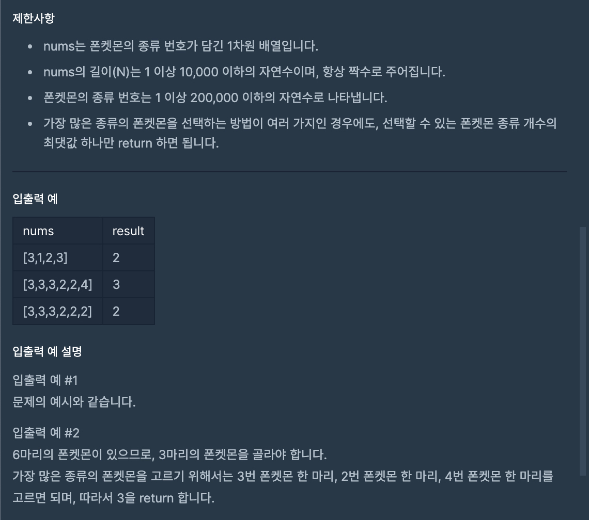
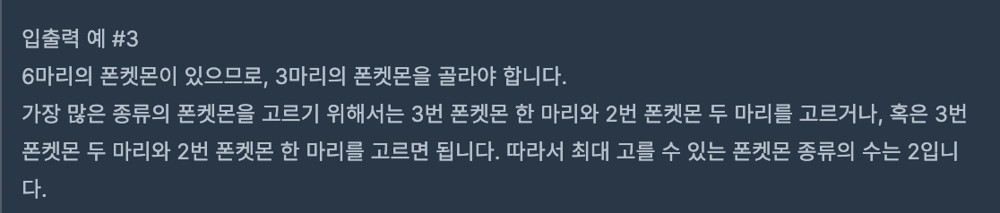

# 32일차






```javascript
function solution(nums) {
    const maxCount = nums.length / 2;      // 최대 가질 수 있는 번호 갯수.
    const arr = nums.filter((item, index) => nums.indexOf(item) === index); // 중복제거
    
    return maxCount >= arr.length ? arr.length : maxCount;
}
```
