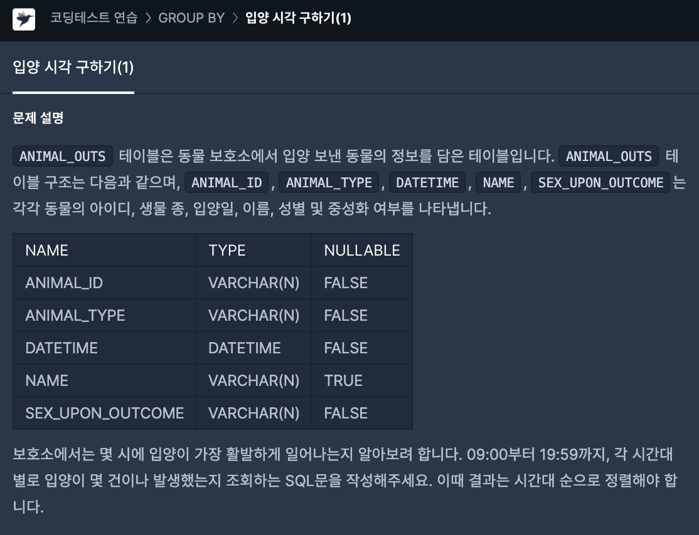

# 17일차

> SELECT date\_format\(DATETIME, '%H'\) AS HOUR, 
>
> COUNT\( date\_format\(DATETIME, '%H'\)\) AS COUNT 
>
> FROM ANIMAL\_OUTS 
>
> WHERE date\_format\(DATETIME, '%H'\) BETWEEN '09' AND '19' 
>
> GROUP BY date\_format\(DATETIME, '%H'\) 
>
> ORDER BY date\_format\(DATETIME, '%H'\);

