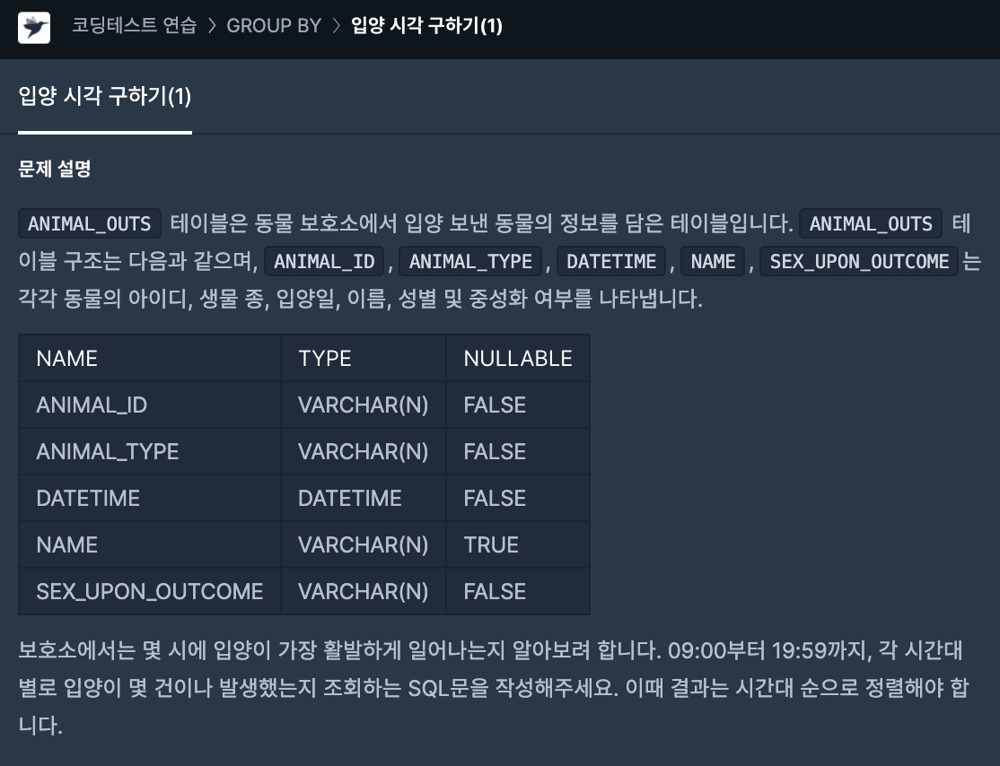

# 17일차

> SELECT date\_format(DATETIME, '%H') AS HOUR,&#x20;
>
> COUNT( date\_format(DATETIME, '%H')) AS COUNT&#x20;
>
> FROM ANIMAL\_OUTS&#x20;
>
> WHERE date\_format(DATETIME, '%H') BETWEEN '09' AND '19'&#x20;
>
> GROUP BY date\_format(DATETIME, '%H')&#x20;
>
> ORDER BY date\_format(DATETIME, '%H');
