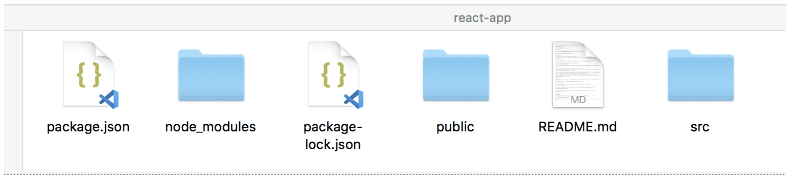
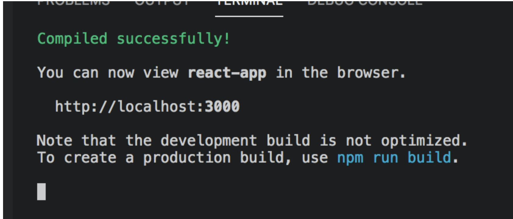
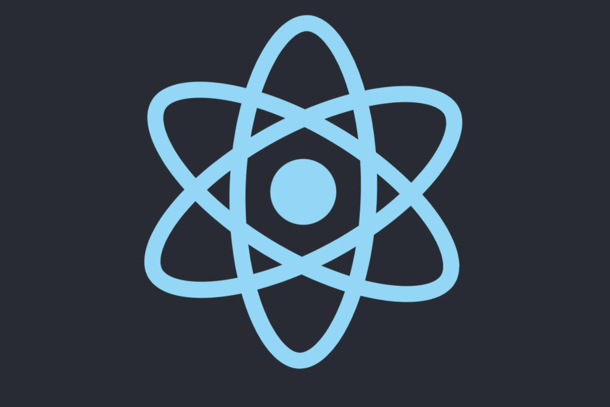

# react

### create-react-app 사용해서 react 개발환경 만들기

1. terminal 에서 sudo npm install -g create-react-app
2. create-react-app -V \(version 확인\)
3. 바탕화면에 react-app 이라는 폴더 생성
4. terminal 로 해당 폴더로 이동\(cd /Users/song-anjelra/Desktop\)
5. react-app 폴더로 이동\(cd react-app\)
6. create-react-app . 입력\(react 환경 구축\) -&gt; 완료가 되면 해당 폴더에 하단과 같이 나옴.

### create-react-app 실행시키기

1. terminal \(cd /Users/song-anjelra/Desktop/react-app 폴더로 이동\)에서 npm run start 라고 입력.

