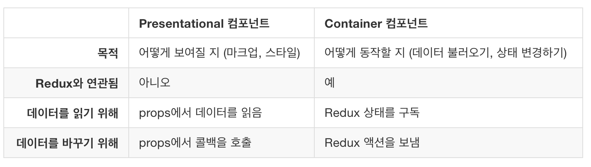
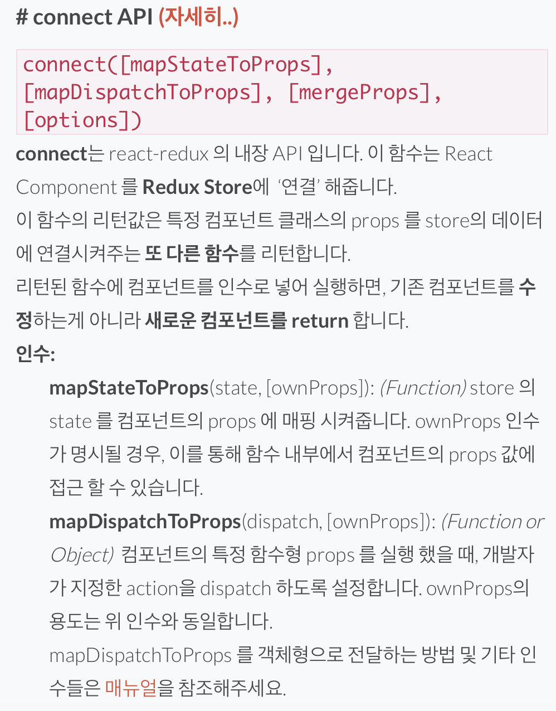
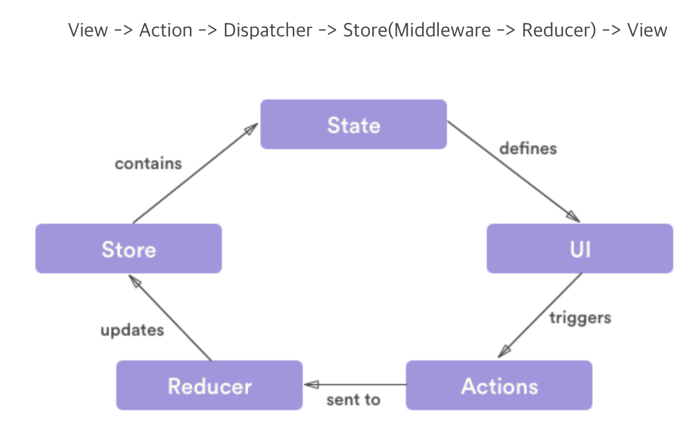

# react

### create-react-app 사용해서 react 개발환경 만들기

* Presentational 컴포넌트는 단순히 뷰 만들 보여주기 위해 만들어진 컴포넌트
* Container 컴포넌트는 리덕스와 연동된 컴포넌트 

### Container 컴포넌트

* Container 컴포넌트와 Presentational 컴포넌트의 props에 연결하기 위해서는 connect API가 필요함.

### redux lifecycle

### react를 이용한 SSR\(Server Side Rendering\)



