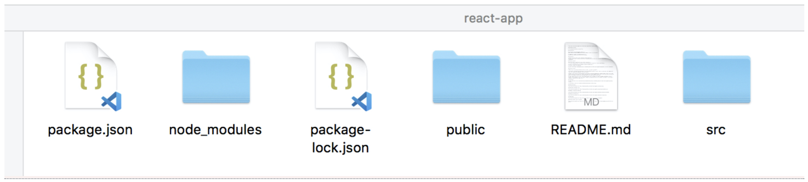
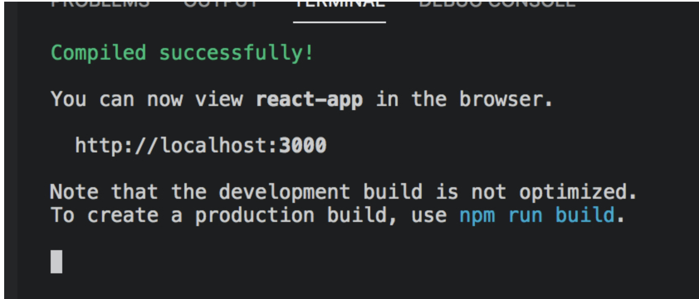
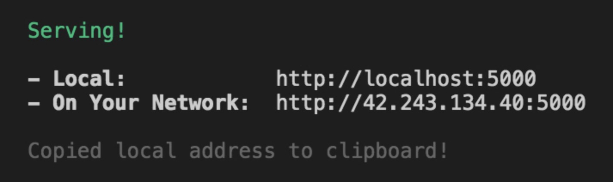
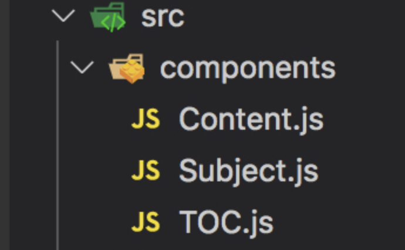

# react

### create-react-app 사용해서 react 개발환경 만들기

1. terminal 에서 sudo npm install -g create-react-app
2. create-react-app -V (version 확인)
3. 바탕화면에 react-app 이라는 폴더 생성
4. terminal 로 해당 폴더로 이동(cd /Users/song-anjelra/Desktop)
5. react-app 폴더로 이동(cd react-app)
6. create-react-app . 입력(react 환경 구축) -> 완료가 되면 해당 폴더에 하단과 같이 나옴.



### create-react-app 실행시키기

1. terminal (cd /Users/song-anjelra/Desktop/react-app 폴더로 이동)에서 npm run start 라고 입력.




### create-react-app build (배포)

1. npm run build (build 라는 폴더가 생김)
2. npm install -g serve (serve라는 명령어를 이용해서 어디서든지 server를 셋팅할 수 있게 설정)
3. serve -s build (build폴더안에 있는 파일을 document root로 하겠다 라는 뜻(-s))



### react 기본 구조(아무리 복잡해져도 이 부분은 변하지 않는다)

1. react의 시작 파일은 public/index.html 파일( js 동일)&#x20;
   1. index.html 파일안에 보면 \<div id="root">\</div> 가 있는데, 이 안에 데이터를 넣음.
   2. index.js에 들어가보면 하단과 같이 \<App /> 이 부분이 import 한 App 을 의미함.

```jsx
import React from 'react';
import ReactDOM from 'react-dom';
import './index.css';
import App from './App';
import * as serviceWorker from './serviceWorker';

// <App /> 은 사용자 component.
ReactDOM.render(
  <React.StrictMode>
    <App />
  </React.StrictMode>,
  document.getElementById('root')
);
```

2\. ./App 파일에 들어가보면 하단과 같이 component를 만들고 하나의 App class안에 넣은 후 export 시키는 방식으로 되어있음.

```
class Subject extends Component {
  // 자바스크립트 최신 스펙.. class 안에 선언된 function은 function 생략. 따라서 render()는 함수임.
  // 주의!!!! component를 만들 때는 반드시 하나의 최상위 태그로 시작해야함.
  // 여기서는 header가 최상위 태그임..
  render() {
    return (
      <header>
            <h1>WEB</h1>
            world wide web!
        </header>
    );
  }
}

// table of content(TOC) -> 목차
class TOC extends Component {
  render() {
    return (
      <nav>
          <ul>
              <li><a href="1.html">HTML</a></li>
              <li><a href="2.html">CSS</a></li>
              <li><a href="3.html">Javascript</a></li>
          </ul>
      </nav>
    );
  }
}

class Content extends Component {
  render() {
    return (
      <article>
        <h2>HTML</h2>
        HTML is HyperText Markup Language.
      </article>
    );
  }
}

class App extends Component {
  render() {
    return (
      <div className="App">
        <Subject></Subject>
        <TOC></TOC>
        <Content></Content>
      </div>
    );
  };
}
export default App;
```

### react component 쪼개기



#### App.js 구성

```
import React, { Component } from 'react';
import './App.css';
import TOC from './components/TOC';
import Content from './components/Content';
import Subject from './components/Subject';
```

#### 예를 들어, component TOC.js 파일을 살펴보기(이런식으로 쓰면 재사용이 용이하며 소스도 간결해짐)

```
// React 라는 라이브러리에서 Component 라는 클래스를 로딩한다는 뜻
import React, { Component } from 'react';

// table of content(TOC) -> 목차
class TOC extends Component {
    render() {
      return (
        <nav>
            <ul>
                <li><a href="1.html">HTML</a></li>
                <li><a href="2.html">CSS</a></li>
                <li><a href="3.html">Javascript</a></li>
            </ul>
        </nav>
      );
    }
}

// TOC라는 js 를 가져다 쓰는 쪽에서 이 코드로 인해 TOC 라는 클래스를 가져갈수 있게 됨.
export default TOC;
```

### props와 state(철저하게 분리되어 있어야 함)

* props : 사용자에게 중요한 정보(component를 외부에서 조작)
* state : 내부적으로 상태를 관리할 때 사용하는 정보

### state

상위 component인 App의 상태를 하위 component로 전달하고 싶을 때는 상위 component의 state값을 하위 component의 props 로 전달하는 것은 얼마든지 가능하다.

### Each child in a list should have a unique "key" prop.

**자동으로 리스트를 생성해줄 때에는 key 라는 prop 을 만들어줘야 한다. 이거는 우리가 사용하기 위해서라기 보다는 리엑트 자체에서 필요해서 구현해달라고 요청하는 것이기 때문에 그냥 unique한 값을 넣어주면 된다.**

### react event

* event를 엘리먼트에 걸어야 할 때, this는 해당 컴포넌트가 아닌 undefined 값이 됨. this를 유지시켜주기 위해서,&#x20;
  * bind()함수를 통해서 this를 유지시켜 준다.
  * 화살표 함수 => 를 사용해서 this를 유지시켜 준다.

### 데이터 전달방식

[.png)](https://github.com/anjelra/useful\_gitbook/blob/master/.gitbook/assets/image%20\(23\).png)

상위 component 가 하위 component 로 데이터를 전달할 때는 props를 이용해서 전달한다.

하위 component에서 상위 component의 데이터를 전달할 때는 event 를 쓴다.(props는 바꿀 수 없기 때문에)

#### shouldComponentUpdate(newProps, newState) 함수

* render() 함수 전에 호출된다.
* shouldComponentUpdate() 함수의 return 값이 true면 render() 함수가 호출된다.
* shouldComponentUpdate() 함수의 return 값이 false면 render() 함수가 호출되지 않는다.
* shouldComponentUpdate()는 두 개의 매개변수를 가지는데 이 매개변수를 통해 새롭게 생성된 props, state 값에 접근할 수 있고, 이전 값에도 접근할 수 있다.(ex: newProps.data, this.props.data)

#### 성능에 문제가 있다면 Immutable.js 를 찾아보자!!

#### React-Router


