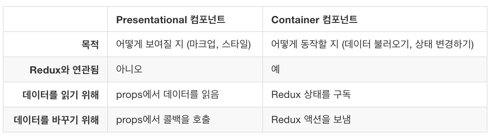
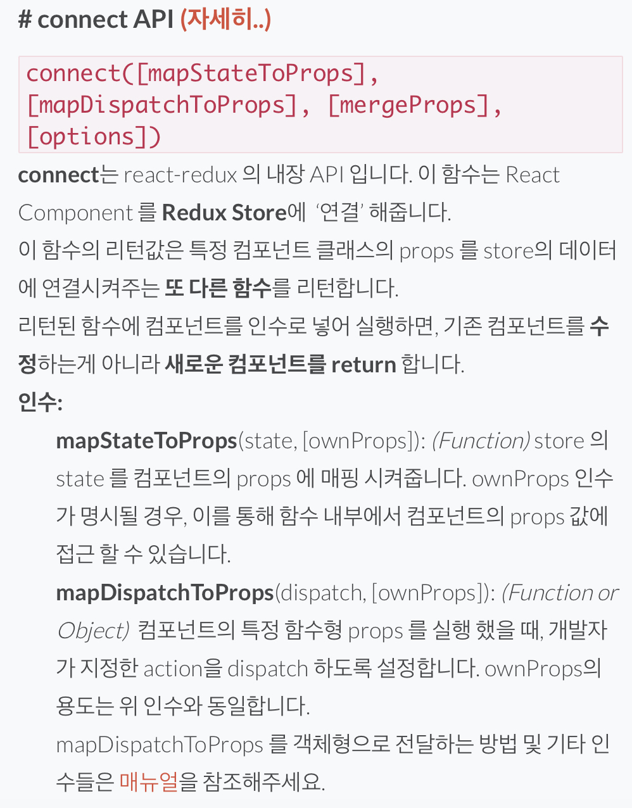
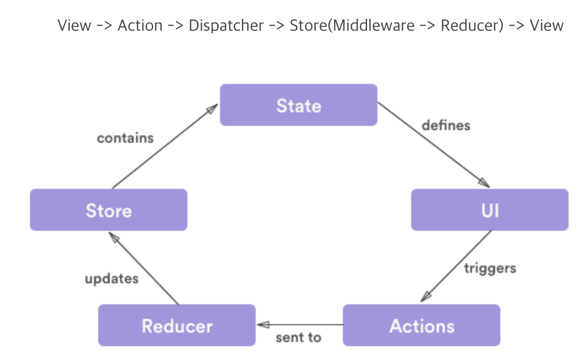

# redux

### Presentational 컴포넌트 vs Container 컴포넌트



* Presentational 컴포넌트는 단순히 뷰 만들 보여주기 위해 만들어진 컴포넌트
* Container 컴포넌트는 리덕스와 연동된 컴포넌트&#x20;

### Container 컴포넌트

* Container 컴포넌트와 Presentational 컴포넌트의 props에 연결하기 위해서는 connect API가 필요함.



### redux lifecycle



### state를 통한 data 다루기

#### Objects are not valid as a React child 에러발생 이

* todo 처럼 list를 다룰 경우에는 action 함수에서 payload를 받아서 통으로 넘겨주면 되는데 이렇게 되면 화면에 뿌려줄 때 map 을 이용해서 데이터를 받아야 하기 때문에 해당 state를 map을 이용해 변환해서 뿌려줘야 한다.

```jsx
const {docsList} = useSelector(state => ({
    docsList: state.docs.docsList
}));
const listItems = docsList.map(list => (
    <li key={list._id}>{list.path}</li>
));
```
